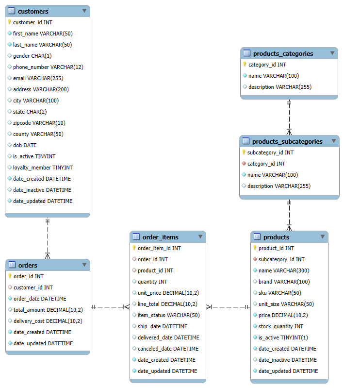
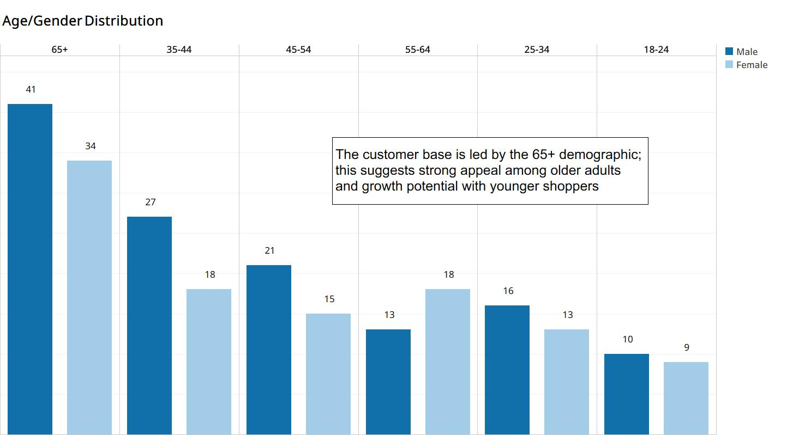
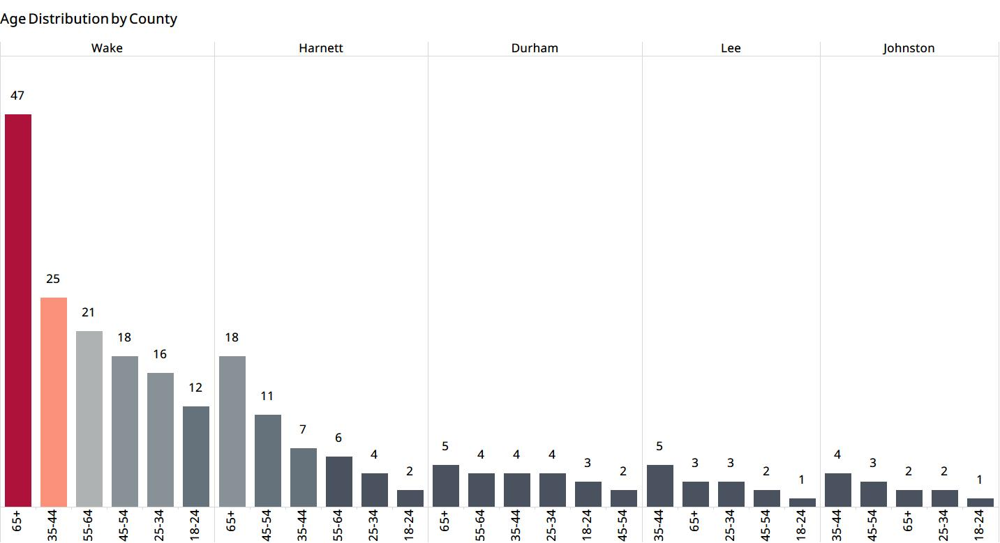
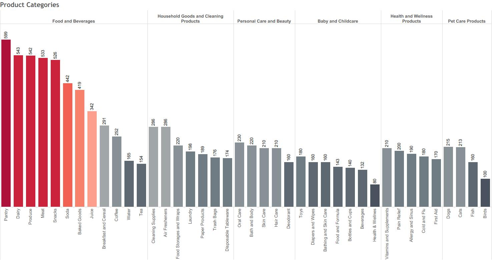

# Welcome to the Tmart Project


<!-- 
 -->

## :pushpin: Overview

Tmart is a simulated retail (grocery) data project that simulates the backend database of a small grocery and household goods store

## :dart: Objectives

- Design a scalable retail database schema
- Generate realistic, high-volume data
- Simulate real-world business scenarios
- Enable analytics-ready datasets

## 🚀 Future Enhancements

- seasonal demand
- promotions / discounts
- inventory tracking
- dashboards

## :books: Create Schema

1. [Create Schema](sql/schema/create_tmart_db.sql)
2. [Create Product tables](sql/schema/product_tables.sql)
3. [Create Customer table](sql/schema/customer_table.sql)
4. [Create Order tables](sql/schema/order_tables.sql)

## :cd: ER Diagram



## :gear: Data Generation

### Product Categories were provided

Insert the Product Categories/Subcategories into then MySQL DB

| SQL | Table | DB export (csv) |
| -- | -- | -- |
| [Insert statement](sql/seed/insert_tmart_products_categories.sql) | tmart.product_categories | [Product Categories export](data/DB_exports/tmart_products_categories_export.csv) |
| | tmart.product_subcategories | [Product Subcategory export](data/DB_exports/tmart_products_subcategories_export.csv) |

### Asked ChatGPT to create python scripts to create synthetic data

I reviewed and tailored the scripts to meet my needs.

| Python script | Output | Insert | Target table | DB export |
| -- | -- | -- | -- | --|
| [generate_products.py](python/generate_tmart_products.py) | [Products csv file](data/raw/tmart_products.csv) | [Insert Products](sql/seed/import_tmart_products.sql) | tmart.products | [Products DB export](data/DB_exports/tmart_products_export.csv) |
| [generate_customers.py](python/generate_customers.py) | [Customer csv file](data/raw/tmart_products.csv) | [Insert Customers](sql/seed/import_customers.sql) | tmart.customers | [Customer DB export](python/DB_exports/generate_customers.py) |
| [generate_orders.py](python/generate_orders.py) | n/a | script inserts data into tables | tmart.orders <br> tmart.order_items | [Orders DB export](data/DB_exports/tmart_orders_export.csv) <br> [Order Items DB export](data/DB_exports/tmart_order_items_export.csv) |

## :wrench: Data Cleaning (work in progress)

`tmart.orders.total_amount` - When an order contains  canceled items, the total amount may be incorrect

<details>
<summary>Expand to view details.</summary>

```sql
WITH cte_canceled AS
  (SELECT order_id,
          sum(line_total) canceled_amt
   FROM order_items
   WHERE item_status = 'Canceled'
   GROUP BY order_id),
     cte_not_canceled AS
  (SELECT order_id,
          sum(line_total) not_canceled_amt,
          group_concat(DISTINCT item_status) not_canceled_status
   FROM order_items
   WHERE item_status != 'Canceled'
   GROUP BY order_id)
SELECT a.order_id,
       a. canceled_amt,
       coalesce(b.not_canceled_amt, 0) not_canceled_amt,
       not_canceled_status,
       o.total_amount
FROM cte_canceled a
LEFT JOIN cte_not_canceled b ON a.order_id = b.order_id
JOIN orders o ON a.order_id = o.order_id
LIMIT 5;
```

| order_id | canceled_amt | not_canceled_amt | not_canceled_status | total_amount |
| -- | --: | --: | -- | --: |
| 1 | 8.78 | 206.02 | Delivered,Shipped | 214.80 |
| 6 | 32.64 | 99.89 | Delivered,Shipped | 132.53 |
| 9 | 7.40 | 0.00 | NULL | 7.40 |
| 10 | 38.95 | 0.00 | NULL | 38.95 |
| 11 | 26.75 | 145.09 | Delivered | 171.84 |

*total_amount is wrong on the orders with canceled items, should be the same as the not_canceled_amt*

</details>  
<br>

`tmart.orders.delivery_cost` - Delivery charges may need to be revised for orders that include  canceled items.  

<div align="center">

| Order Amount | Delivery Cost |
| -- | :--: |
| Orders >= $75 | Free |
| Orders >= $50 | $5 |
| Orders >= $25 | 10 |
| Orders < $25 | $25 |

</div>

`tmart.customer.gender` - add gender to the customer profile

<details>
<summary>Expand to view details.</summary>

```sql
ALTER TABLE tmart.customers ADD COLUMN gender CHAR(1) NULL AFTER last_name;

SELECT DISTINCT first_name,
                gender
FROM customers;


UPDATE customers
SET gender = 'M'
WHERE first_name IN ('Andrew', 'Charles', 'Christopher', 'Daniel',
                     'David', 'James', 'Jason', 'John', 'Joseph',
                     'Liam', 'Matthew', 'Michael', 'Randy',
                     'Richard', 'Robert', 'Thomas', 'William');


UPDATE customers
SET gender = 'F'
WHERE first_name NOT IN ('Andrew', 'Charles', 'Christopher', 'Daniel',
                         'David', 'James', 'Jason', 'John', 'Joseph',
                         'Liam', 'Matthew', 'Michael', 'Randy',
                         'Richard', 'Robert', 'Thomas', 'William');
```

</details>  

## :flashlight: Examine the Data (work in progress)

### Customers

<details>
<summary>Expand to view details.</summary>

```sql
-- num of customers and avg age in each county/city
SELECT county,
       city,
       sum(if(is_active, 1, 0)) active_customers,
       round(avg(CASE
                     WHEN is_active THEN YEAR(CURDATE()) - YEAR(dob) - (RIGHT(CURDATE(), 5) < RIGHT(dob, 5))
                 END)) avg_age_active,
       sum(if(is_active, 0, 1)) inactive_customers,
       round(avg(CASE
                     WHEN NOT is_active THEN YEAR(CURDATE()) - YEAR(dob) - (RIGHT(CURDATE(), 5) < RIGHT(dob, 5))
                 END)) avg_age_not_active
FROM customers
GROUP BY 1,
         2
ORDER BY active_customers DESC,
         avg_age_active DESC;
```

| county | city | active_customers | avg_age_active | inactive_customers | avg_age_not_active |
| -- | -- | :--: | :--: | :--: | :--: |
| Wake | Raleigh | 67 | 52 | 24 | 56 |
| Durham | Durham | 22 | 48 | 7 | 56 |
| Wake | Cary | 18 | 59 | 3 | 54 |
| Wake | Garner | 15 | 44 | 5 | 40 |
| Wake | Morrisville | 14 | 65 | 3 | 42 |
| Lee | Sanford | 14 | 45 | 3 | 32 |
| Harnett | Broadway | 13 | 62 | 1 | 63 |
| Johnston | Clayton | 12 | 45 | 1 | 47 |
| Harnett | Erwin | 11 | 55 | 5 | 50 |
| Harnett | Angier | 9 | 50 | 1 | 46 |
| Wake | Apex | 9 | 42 | 1 | 84 |
| Wake | Fuquay-Varina | 8 | 66 | 3 | 34 |
| Wake | Holly Springs | 8 | 58 | 3 | 44 |
| Harnett | Lillington | 8 | 56 | 1 | 80 |
| Harnett | Dunn | 7 | 52 | 4 | 60 |




</details>

### Products

<details>
<summary>Expand to view details.</summary>

```sql
SELECT c.name category,
       s.name subcategory,
       sum(is_active) num_active_products,
       count(DISTINCT sku) num_skus,
       count(DISTINCT brand) num_brands
FROM products_categories c
JOIN products_subcategories s ON c.category_id = s.category_id
JOIN products p ON s.subcategory_id = p.subcategory_id
WHERE p.is_active = 1
GROUP BY 1,
         2
ORDER BY 1,
         2
```

| category | subcategory | num_active_products | num_skus | num_brands |
| -- | -- | --: | --: | --: |
| Baby and Childcare | Bathing and Skin Care | 160 | 160 | 10 |
| Baby and Childcare | Beverages | 132 | 132 | 11 |
| Baby and Childcare | Bottles and Cups | 140 | 140 | 10 |
| Baby and Childcare | Diapers and Wipes | 160 | 160 | 10 |
| Baby and Childcare | Food and Formula | 143 | 143 | 11 |
| Baby and Childcare | Health & Wellnes | 80 | 80 | 10 |
| Baby and Childcare | Toys | 180 | 180 | 10 |
| Food and Beverages | Baked Goods | 419| 419 | 11 |
| Food and Beverages | Breakfast and Cereal | 291 | 291 | 11 |
| Food and Beverages | Coffee | 252 | 252 | 11 |
| Food and Beverages | Dairy | 543 | 543 | 11 |
| Food and Beverages | Juice | 342 | 342 | 11 |
| Food and Beverages | Meat | 533 | 533 | 11 |
| Food and Beverages | Pantry | 599 | 599 | 11 |
| Food and Beverages | Produce | 542 | 542 | 11 |
| Food and Beverages | Snacks | 526 | 526 | 11 |
| Food and Beverages | Soda | 442 | 442 | 11 |
| Food and Beverages | Tea | 154 | 154 | 11 |
| Food and Beverages | Water | 165 | 165 | 11 |
| Health and Wellness Products | Allergy and Sinus | 190 | 190 | 10 |
| Health and Wellness Products | Cold and Flu | 180 | 180 | 10 |
| Health and Wellness Products | First Aid | 170 | 170 | 10 |
| Health and Wellness Products | Pain Relief | 200 | 200 | 10 |
| Health and Wellness Products | Vitamins and Supplements | 210 | 210 | 10 |
| Household Goods and Cleaning Products | Air Fresheners | 286 | 286 | 11 |
| Household Goods and Cleaning Products | Cleaning Supplies | 286 | 286 | 11 |
| Household Goods and Cleaning Products | Disposable Tableware | 174 | 174 | 11 |
| Household Goods and Cleaning Products | Food Storages and Wraps | 220 | 220 | 11 |
| Household Goods and Cleaning Products | Laundry | 198 | 198 | 11 |
| Household Goods and Cleaning Products | Paper Products | 189 | 189 | 11 |
| Household Goods and Cleaning Products | Trash Bags | 176 | 176 | 11 |
| Personal Care and Beauty | Bath and Body | 220 | 220 | 11 |
| Personal Care and Beauty | Deodorant | 160 | 160 | 10 |
| Personal Care and Beauty | Hair Care | 210 | 210 | 10 |
| Personal Care and Beauty | Oral Care | 230 | 230 | 10 |
| Personal Care and Beauty | Skin Care | 210 | 210 | 10 |
| Pet Care Products | Birds | 100 | 100 | 10 |
| Pet Care Products | Cats | 213 | 213 | 10 |
| Pet Care Products | Dogs | 215 | 215 | 10 |
| Pet Care Products | Fish | 160 | 160 | 10 |



</details>

### Orders

<details>
<summary>Expand to view details.</summary>


[Designed by Freepik](www.freepik.com)

</details>

<!--
## :window: Views

### [v_customer_orders](sql/views/v_customer_orders.sql)

| Column | Datatype | |
| --| -- | -- |
| customer_id | INT | |
| city | VARCHAR | |
| state | CHAR | |
| zipcode | VARCHAR | |
| county | VARCHAR | |
| customer_active | TINYINT | |
| customer_create_date | DATETIME | |
| customer_inactive_date | DATETIME | |
| loyalty_member | TINYINT | |
| order_date| DATETIME | |
| total_amount | DECIMAL | |
| delivery_cost | DECIMAL | |
| product_id | INT | |
| product_name | VARCHAR | |
| category | VARCHAR | |
| subcategory | VARCHAR | |
| item_qty | INT,binary | |
| item_unit_price | DECIMAL | |
| item_line_total | DECIMAL | |
| item_status | VARCHAR | |
| item_ship_date | DATETIME | | 
-->
