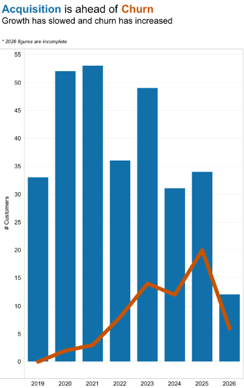
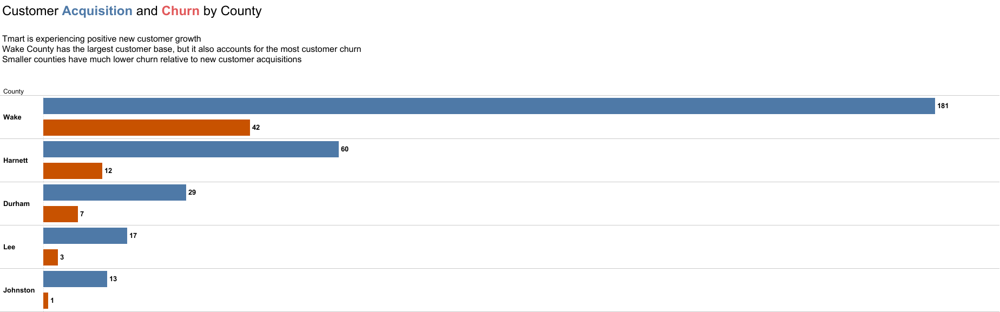
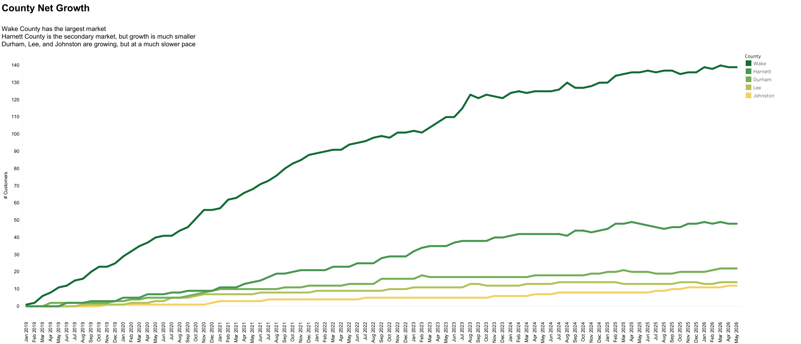
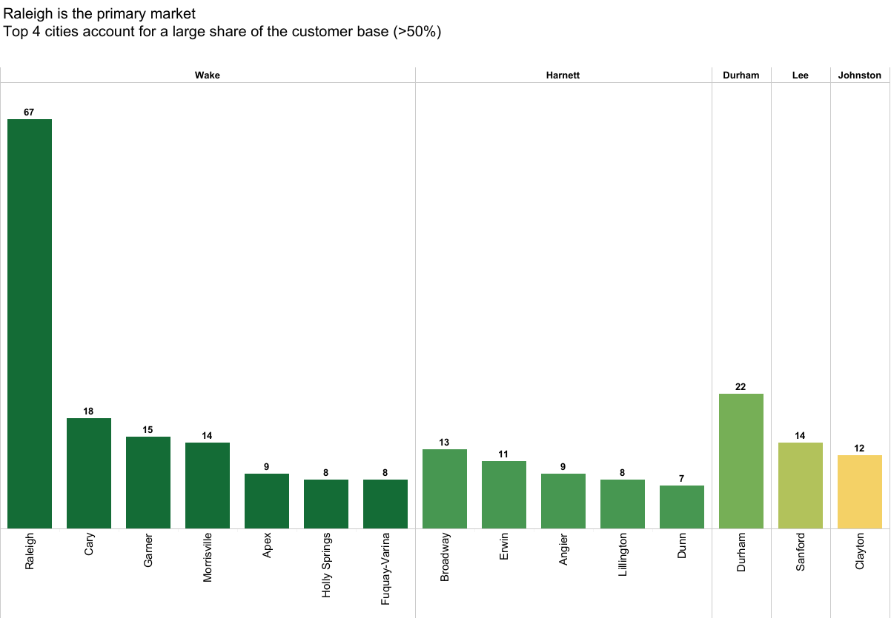

# 🔎 Data Analytics

## Table of Contents

- [Marketing Analysis](#marketing-analysis)
  - [Customer Acquisition & Growth](#customer-acquisition--growth)

# Marketing Analysis

## Customer Acquisition & Growth

**Prepared For:** Marketing Manager

Expand to view details.

- [Purpose](#purpose)
- [Data & Methodology](#data--methodology)
- [Key Findings](#key-findings)
- [Recommendations](#recommendations)
- [Next Steps & Decision Required](#next-steps--decision-required)
- [Supplemental Information](#supplemental-information)

### Purpose

The purpose of this analysis is to provide leadership with a clear view of customer growth performance and prioritize acquisition and retention efforts.

### Data & Methodology

This analysis is based on customer data from the Customer Dimension table in the tmart_analytics database (January 2019-May 2026), evaluates new customer acquisition by county and city.  Month-over-month growth trends were derived and customer attrition compared against new acquisitions to determine growth.  Known data limitations are outlined in the findings.

### Key Findings

_* 2026 figures are incomplete_

---

- **New customer acquisition peaked in 2020-2021, then dropped in 2022, recovered in 2023, and has trended down since (2026 is partial year, so it's not comparable yet)**
- **Customer acquisition continues to be ahead of churn; however, growth has slowed and churn has increased**

 

 ---

- **Wake County has the largest customer base, but it also accounts for the most customer churn**
- **Smaller counties have much lower churn relative to new customer acquisitions**

--- 

- **Wake County has the largest market**
- **Harnett County is the secondary market, but growth is much smaller**
- **Durham, Lee, and Johnston are growing, but at a much slower pace**

---

- **Customer growth is concentrated in a small number of cities.  This creates an opportunity to focus resources where demand is strongest, but also a risk of becoming overly reliant on a limited set of markets.**

### Recommendations

- Raleigh is the leading market. Identifying what is behind customer acquisition (population density, local demand, or marketing) could help replicate that success in other cities.
- Expanding marketing efforts into neighboring cities may diversify growth and create a more balanced customer base across each county.
- The business should identify what drives acquisition spikes (marketing campaigns, promotions, seasonal demand, referrals, etc.) and determine whether those factors can be replicated throughout the year.

### Next Steps & Decision Required

- Improve customer data collection by capturing the primary acquisition source (marketing campaign, promotion, referral, word of mouth, social media, or other channels), and their reason for departure when applicable.  This data will enable analysis of which acquisition strategies are most effective and support more informed marketing investment decisions and reveal opportunities to improve customer retention.

### Supplemental Information

- [Datasets](../data/star_schema/dim_customers.csv)
- [SQL Queries](./data_analytics_sql.md)