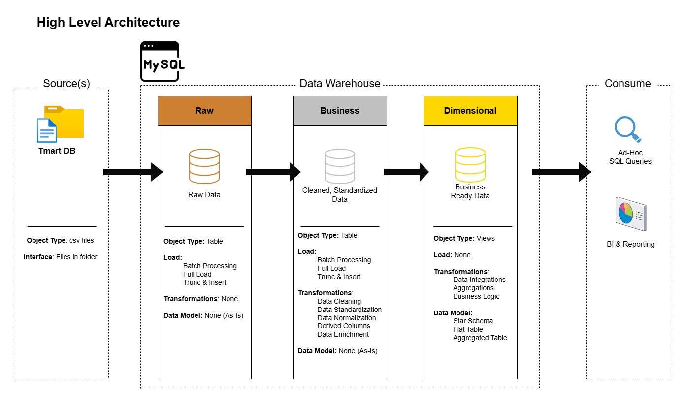
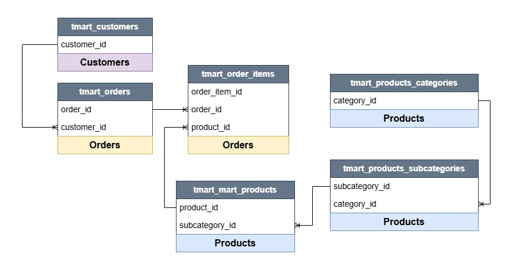
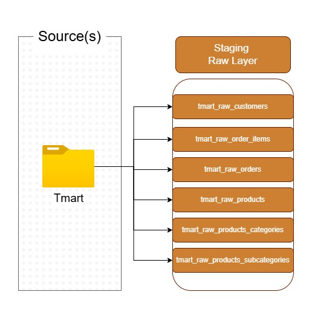
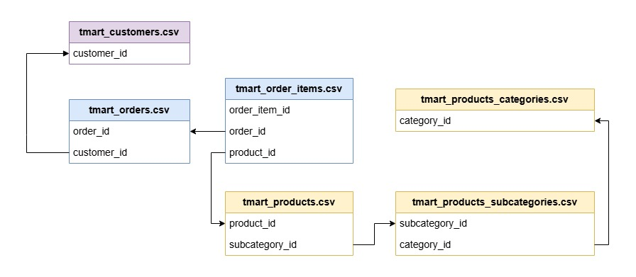
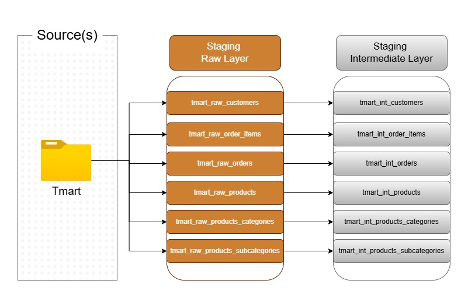
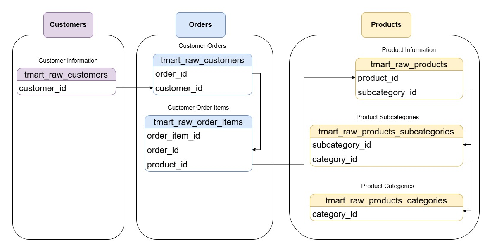
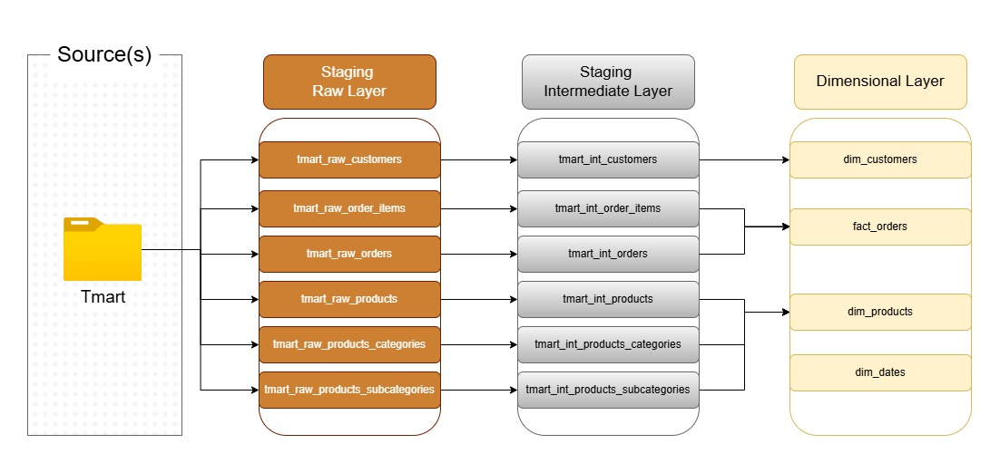
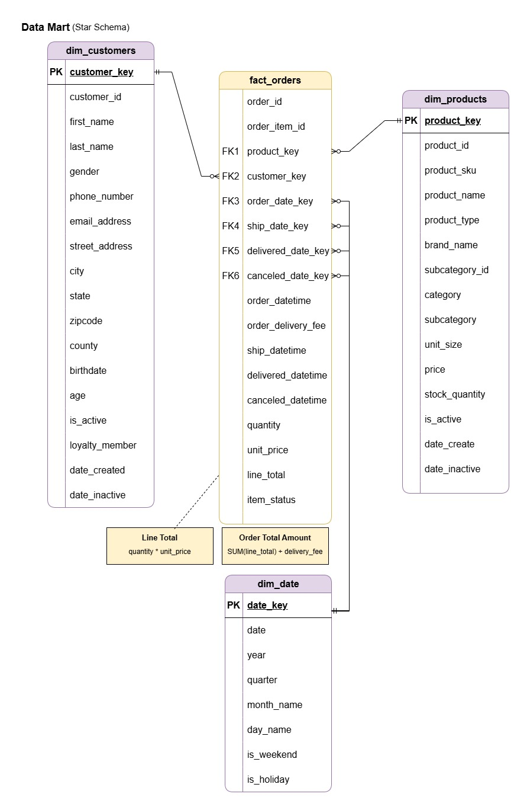

# :star: SQL Data Warehouse

Make the database ready for analytics, enabling BI reporting and dashboards.

## Table of Contents

- [Overview](#overview)
- [Source Data](#source-data)
- [Staging Raw Layer](#staging-raw-layer)
- [Staging Intermediate Layer](#2-staging-intermediate-layer)
- [Dimensional Layer](#3-dimensional-layer)

## Overview

Note: All source data is synthetic, generated via a Python script.  

| Component | Detail |
| -- | -- |
| Tech Stack | MySQL, Python |
| Source Data | cvs files (exported from Tmart DB) |
| Staging Schema | tmart_staging (raw & intermediate) |
| Analytics Schema | tmart_analytics (dimensional) - analytics-ready |
| Data Type | Synthetic - generated via Python |

 

## Source Data

**Table Relationships**

### Files & Row Counts

| File | Description | Approx. Rows |
| -- | -- | --: |
| tmart_customers.csv | Customer data | 300 |
| tmart_orders.csv | Order header records | 10,200 |
| tmart_order_items.csv | Line-level order detail | 45,473 |
| tmart_products.csv | Product catelog | 10,000 |
| tmart_products_subcategories.csv | Subcategory reference | 40 |
| tmart_products_categories.csv | Category reference | 6 |

### Date Range

| Attribute | Value |
| -- | -- |
| Earliest Order | 2019-06-24 |
| Latest Order | 2026-04-30 |
| Customer Records Span | 2019-01-22 to 2026-04-06 |

## Staging Raw Layer

The raw staging tables (tmart_raw_*) act as a landing zone for source data, no changes to the data.

**Data Flow**  

Expand to view details.

 

<table>
    <tr>
        <td valign=top width=30%>
            <h3>Analysis</h3>
        </td>
        <td width=70%>
            
             
            <table>
              <tr>
                <th>csv file</th>
                <th># of rows</th>
                <th>Column Headers</th>
              </tr>
              <tr>
                <td valign=top>tmart_customers.csv</td>
                <td valign=top>300</td>
                <td>customer_id, first_name, last_name, gender, phone_number, email, address, city, state, zipcode, county, dob, is_active, loyalty_member, date_created, date_inactive, date_updated</td>
              </tr>
              <tr>
                <td valign=top>tmart_order_items.csv</td>
                <td valign=top>45,473</td>
                <td>order_item_id, order_id, product_id, quantity, unit_price, line_total, item_status, ship_date, delivered_date, canceled_date,date_created, date_updated</td>
              </tr>
              <tr>
                <td valign=top>tmart_orders.csv</td>
                <td valign=top>10,200</td>
                <td>order_id, customer_id, order_date, total_amount, delivery_cost,  date_created, date_updated</td>
              </tr>
              <tr>
                <td valign=top>tmart_products.csv</td>
                <td valign=top>10,000</td>
                <td>product_id, subcategory_id, name, brand, sku, unit_size, price,  stock_quantity, is_active, date_created, date_inactive, date_updated</td>
              </tr>
              <tr>
                <td valign=top>tmart_products_categories.csv</td>
                <td valign=top>6</td>
                <td>category_id, name, description</td>
              </tr>
              <tr>
                <td valign=top>tmart_products_subcategories.csv</td>
                <td valign=top>40</td>
                <td>subcategory_id, category_id, name, description</td>
              </tr>
            </table>
        </td>
    </tr>
    <tr>
        <td width=30%>
            <h3>Create Raw Tables</h3>
        </td>
        <td width=70%>
             
             🔗 <a href="../sql/staging_raw/create_raw_tables.sql">DDL</a>
          

        </td>
    </tr>
    <tr>
        <td width=30%>
            <h3>Data Load</h3>
        </td>
        <td width=70%>
             
             🔗 <a href="../sql/staging_raw/load_raw_tables.sql">DML</a>
          

        </td>
    </tr>
    <tr>
        <td valign=top width=30%>
            <h3>Validation</h3>
        </td>
        <td width=70%>
             
            <table>
              <tr>
                <th>csv file</th>
                <th>Table</th>
                <th># rows</th>
                <th>column headers match</th>
              </tr>
              <tr>
                <td>tmart_customers.csv</td>
                <td>tmart_raw_customers</td>
                <td>300</td>
                <td>Y</td>
              </tr>
              <tr>
                <td>tmart_order_items.csv</td>
                <td>tmart_raw_order_items</td>
                <td>45,473</td>
                <td>Y</td>
              </tr>
              <tr>
                <td>tmart_orders.csv</td>
                <td>tmart_raw_order</td>
                <td>10,200</td>
                <td>Y</td>
              </tr>
              <tr>
                <td >tmart_products.csv</td>
                <td>tmart_raw_products</td>
                <td>10,000</td>
                <td>Y</td>
              </tr>
              <tr>
                <td>tmart_products_categories.csv</td>
                <td>tmart_raw_products_categories</td>
                <td>6</td>
                <td>Y</td>
              </tr>
              <tr>
                <td>tmart_products_subcategories.csv</td>
                <td>tmart_raw_products_subcategories</td>
                <td>40</td>
                <td>Y</td>
              </tr>
            </table>
          

        </td>
    </tr>
</table>

 

## 2. Staging Intermediate Layer

The intermediate staging tables (tmart_int_*) store cleaned and standardized data.

**Data Flow**  

Expand to view details.

 

<table>
    <tr>
        <td valign=top width=30%>
            <h3>Analysis</h3>
        </td>
        <td width=70%>
            
Raw Tables

            
        </td>
    </tr>
    <tr>
        <td valign=top width=30%>
            <h3>Create Tables</h3>
        </td>
        <td width=70%>
             
             🔗 <a href="../sql/staging_int/create_int_tables.sql">DDL</a>
          

        </td>
    </tr>
    <tr>
        <td valign=top width=30%>
            <h3>Data Cleansing & Load</h3>
        </td>
        <td width=70%>
             
             🔗 <a href="../sql/staging_int/load_int_tables.sql">DML</a>
          

        </td>
    </tr>
    <tr>
        <td valign=top width=30%>
            <h3>Transformations</h3>
        </td>
        <td width=70%>
             
            
            <table>
              <tr>
                <th>Table</th>
                <th>Transformation</th>
                <th>Reason</th>
              </tr>
              <tr>
                <td valign=top>All</td>
                <td valign=top>TRIM() on all VARCHAR fields</td>
                <td valign=top>remove unwanted spaces</td>
              </tr>
              <tr>
              <tr>
                <td valign=top>tmart_int_customers</td>
                <td>UPPER(state)    gender changed to 'Male','Female','Other','Unknown'    date_created and date_inactive cast as date (no time on the datetime column in the raw data)    if dob is in the future, set to NULL</td>
                <td valign=top>Consistent values</td>
              </tr>
              <tr>
                <td valign=top>tmart_int_order_items</td>
                <td valign=top>UPPER(item_status)</td>
                <td valign=top>Consistent status values</td>
              </tr>
              <tr>
                <td valign=top>tmart_int_orders</td>
                <td valign=top>date_created cast as date</td>
                <td valign=top>no time on the datatime column in the raw data</td>
              </tr>
              <tr>
                <td valign=top>tmart_int_products</td>
                <td valign=top>UPPER(sku)    product_type (derived column: product name minus the brand)    date_created and date_inactive cast as date (no time on the datetime column in the raw data)</td>
                <td valign=top>Consistent values</td>
              </tr>
            </table>
        </td>
    </tr>
    <tr>
        <td valign=top width=30%>
            <h3>Validation</h3>
        </td>
        <td width=70%>
             
             🔗 <a href="../sql/staging_int/int_validation.sql">Data Validation</a>
          

        </td>
    </tr>
</table>

## 3. Dimensional Layer

A star schema is built using the staging layer to optimize query performance and simplify dashboard development.

**Data Flow**  

Expand to view details.

 

<table>
    <tr>
        <td valign=top width=40%>
            <h3>Create Tables</h3>
        </td>
        <td width=60%>
             
             🔗 <a href="../sql/dimensional/create_star_schema.sql">DDL</a>
          

        </td>
    </tr>
    <tr>
        <td valign=top width=40%>
            <h3>Load Dates (dimension table)</h3>
        </td>
        <td width=60%>
             
             🔗 <a href="../sql/dimensional/load_dim_date.sql">DML</a>
          

        </td>
    </tr>
    <tr>
        <td valign=top width=40%>
            <h3>Validation</h3>
        </td>
        <td width=60%>
             
             🔗 <a href="../sql/dimensional/dim_validataion.sql">Data Validation</a>
          

        </td>
    </tr>
    <tr>
        <td valign=top width=40%>
            <h3>Data Model</h3>
        </td>
        <td width=60%>
            
Star Schema

            
        </td>
    </tr>    
</table>

 

## Data Catalog

- Business focused data model, for analytics and reporting
- Dimensional model composed of fact and dimension tables

### `dim_customers`

- Stores customer details

Expand to view columns.

| Column Name | Data Type | Description |
| --- | --- | --- |
| `customer_key` | int | Customer dimension surrogate key |
| `customer_id` | int | Unique identifier assigned to each customer |
| `first_name` | varchar(50) | Customer's first name |
| `last_name` | varchar(50) | Customer's last name |
| `gender` | varchar(8) | Customer's gender (e.g., 'Male', 'Female', 'Other', 'Unknown') |
| `phone_number` | varchar(12) | Customer's phone number |
| `email_address` | varchar(255) | Customer's email address |
| `street_address` | varchar(200) | Customer's street address |
| `city` | varchar(100) | Customer's city |
| `state` | char(2) | State of residence (e.g. 'NC') |
| `zipcode` | varchar(10) | Customer's zipcode |
| `county` | varchar(50) | County of residence (e.g. 'Wake') |
| `birthdate` | date | Date of birth, formated as YYYY-MM-DD (e.g. 1990-01-31) |
| `age` | int | Customer's age (e.g. 24) |
| `is_active` | tinyint | Customer is still active (e.g. 0, 1) |
| `loyalty_member` | tinyint | Customer is a member of the loyalty program (e.g. 0, 1) |
| `date_created` | date | Date customer record was created |
| `date_inactive` | date | Date customer record became inactive |

### `dim_products`

- Stores product details

Expand to view columns.

| Column Name | Data Type | Description |
| --- | --- | --- |
| `product_key` | int | Product dimension surrogate key |
| `product_id` | int | Unique identifier assigned to each product |
| `product_sku` | varchar(50) | Stock keeping unit |
| `product_name` | varchar(300) | Name of product - 'Brand Name' + 'Product Type' |
| `product_type` | varchar(300) | Type of product (e.g. 'Club Soda') |
| `brand_name` | varchar(100) | Product company name (e.g. 'SunVale Farms') |
| `subcategory_id` | int | Unique identifier assigned to each subcategory |
| `category` | varchar(100) | Product's broad classification (e.g. 'Food and Beverages') |
| `subcategory` | varchar(100) | Product's narrower classification (e.g. 'Produce') |
| `unit_size` | varchar(50) | Quantity or measurement of product (e.g. '10 oz') |
| `price` | decimal(10,2) | Selling price of product |
| `stock_quantity` | int | Number of hand |
| `is_active` | tinyint | Product is still active (e.g. 0, 1) |
| `date_created` | date | Date product record was created |
| `date_inactive` | date | Date product record became inactive |

### `dim_date`

- Calendar table

Expand to view columns.

| Column Name | Data Type | Description |
| --- | --- | --- |
| `date_key` | int | Date dimension surrogate key: YYYYMMDD (e.g. '20250131') |
| `date` | date | Date: YYYY-MM-DD |
| `year` | int | Date's year: YYYY |
| `quarter` | int | Fiscal quarter |
| `month_name` | varchar(9) | Date's month name (e.g. 'January') |
| `day_name` | varchar(9) | Date's weekday name (e.g. 'Monday') |
| `is_weekend` | tinyint | Date falls on a weekend (e.g. 0, 1) |
| `is_holiday` | tinyint | Date is a holiday (e.g. 0, 1) |

### `fact_orders`

- Stores orders, transactional data

Expand to view columns.

| Column Name | Data Type | Description |
| --- | --- | --- |
| `order_id` | int | Unique identifier assigned to each order |
| `order_item_id` | int | Unique identifier assigned to each item on the order |
| `product_key` | int | Surrogate key link to the product dimension table |
| `customer_key` | int | Surrogate key link to the customer dimension table |
| `order_date_key` | int | Surrogate key link to the date dimension table |
| `ship_date_key` | int | Surrogate key link to the date dimension table |
| `delivered_date_key` | int | Surrogate key link to the date dimension table |
| `canceled_date_key` | int | Surrogate key link to the date dimension table |
| `order_datetime` | datetime | Datetime order was placed |
| `order_delivery_fee` | decimal(10,2) | Amount charged for delivery of order (all items) |
| `ship_datetime` | datetime | Datetime line item was shipped |
| `delivered_datetime` | datetime | Datetime line item was delivered |
| `canceled_datetime` | datetime | Datetime line item was canceled |
| `quantity` | int | Number of units ordered (e.g. 1) |
| `unit_price` | decimal(10,2) | Cost per unit or product  (e.g. 0, 4.39) |
| `line_total` | decimal(10,2) | Total price for the line item (e.g. 4.39) |
| `item_status` | varchar(50) | Status of the line item (e.g 'SHIPPED') |

